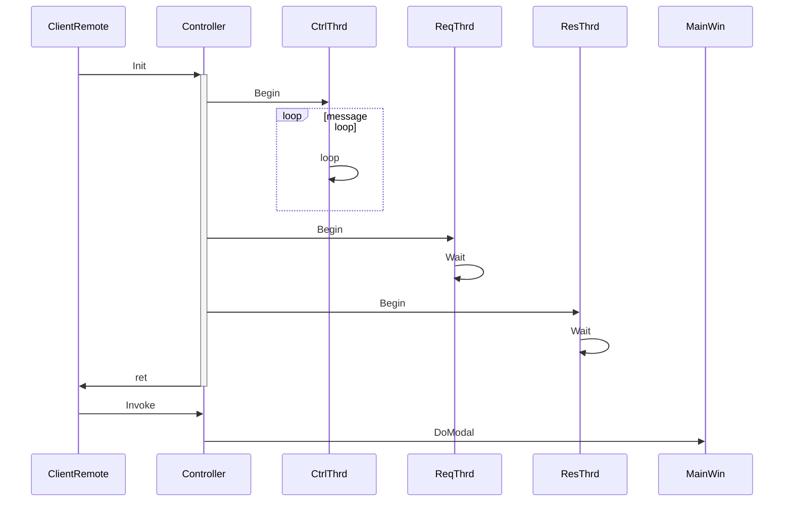
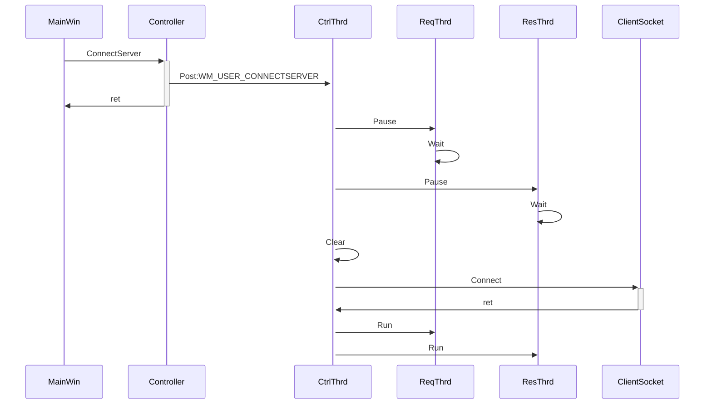
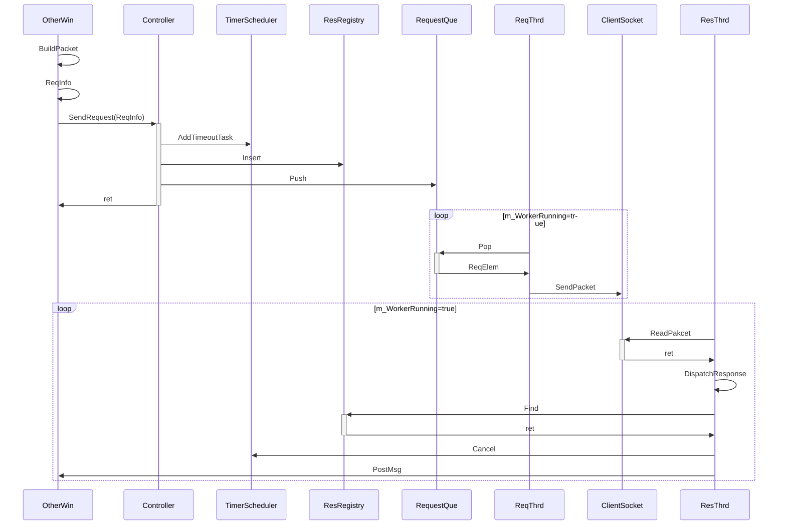
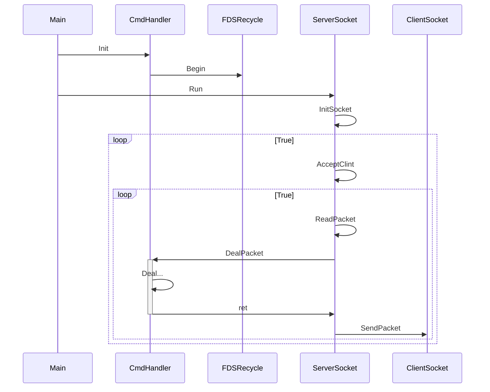

# remote-ctrl

# 📡 remote-ctrl

基于 MFC 的远程控制工具，支持文件管理、远程监控、鼠标操作、锁机/解锁功能。

---

# 🧰 项目简介

`remote-ctrl` 是一个使用 C++ 和 MFC 构建的远程主机控制系统，主要功能包括：

- 📁 查看远程主机的文件
- 📥 远程下载文件
- 🗑️ 远程删除文件
- 📂 远程打开文件或文件夹
- 🖥️ 实时远程桌面监控
- 🖱️ 鼠标控制（移动、点击等操作）
- 🔒 锁定远程主机屏幕
- 🔓 解锁远程主机屏幕

---

# ⚙️ 技术栈

- **语言**：C++
- **框架**：MFC（Microsoft Foundation Classes）
- **开发环境**：Visual Studio 2019
- **平台支持**：仅限 Windows 10

---

# 🚀 快速开始

### 1. 环境准备

- Windows 10 系统
- 安装 [Visual Studio 2019](https://visualstudio.microsoft.com/)
- 安装 MFC 工具包

### 2. 编译步骤

1. 使用 Visual Studio 2019 打开 `remote-ctrl/RemoteCtl/RemoteCtrl.sln` 解决方案
2. 分别编译 `RemoteClient` 和 `RemoteCtrl` 项目
3. 在两台 Windows 10 主机（或虚拟机）中部署（都部署在本地也没有问题）：
	- `RemoteCtrl.exe`：运行在被控端
	- `RemoteClient.exe`：运行在控制端

------

# 📌 注意事项

- 所有功能仅在 **Windows 10** 下开发与测试
- 通信协议基于自定义 TCP 套接字实现
- 建议客户端与服务端在同一网段内测试以减少网络阻碍
- 锁机功能在测试阶段，所以只需要被控制端按下'A'键即可解锁（解锁功能也是发送'A'键的按下操作）
- 如需更改锁机和解锁的条件可在RemoteCtrl项目中的`CmdHandler.cpp`中`UNLOCK_MACHINE_handler`以及`ThreadLockMachine`中的消息循环处理

---

# ✏学习文档

## 客户端启动时序

客户端的启动伴随着三个线程的启动，分别是Ctrl线程负责控制其他两个线程和处理消息循环时间(控制其他线程也是通过消息的形式)，Req线程负责处理其他模块发送的消息，Res线程负责将服务端返回的数据返还给客户端的对应模块

## 连接服务端时序

连接的过程其实就是启动或重启的过程，它会暂停Req线程和Res线程，它会清理消息循环中的垃圾消息和其他容器的数据(比如错误消息，防止连接成功后，因为错误消息而连接失败)，之后连接成功后会再次启动Req和Res线程，不用担心MainWin不知道是否连接成功，应为它会在调用ConnectServer紧接着延时发送一个测试连接，来检验测试结果

## 数据包收发时序

相关模块构造好Packet,以及ReqInfo(携带了是否需要响应，是否需要由Controller接管析构Packet，如果需要返回值给予需要通知的HWND和消息信息)，调用SendRequest，Controller会将ReqInfo解析，将需要发送的Packet放入到RequestQue(ReqThrd会取)，将ResponsePacket以及HWND和消息值注册在ResRegistry map中，同时还会将一个超时任务放到定时调度器里面，如果超过一定的时间没有Response,它会通知对应的模块失败的信息。ResThrd会循环的ReadPacket,然后获取Packet的相关信息，定位这是那个程序的响应包，然后从ResRegistry中寻找相关的其他信息，将读取到的Packet复制到对应程序的响应包指针，然后通过PostMessage通知对应程序

## 服务器启动时序

